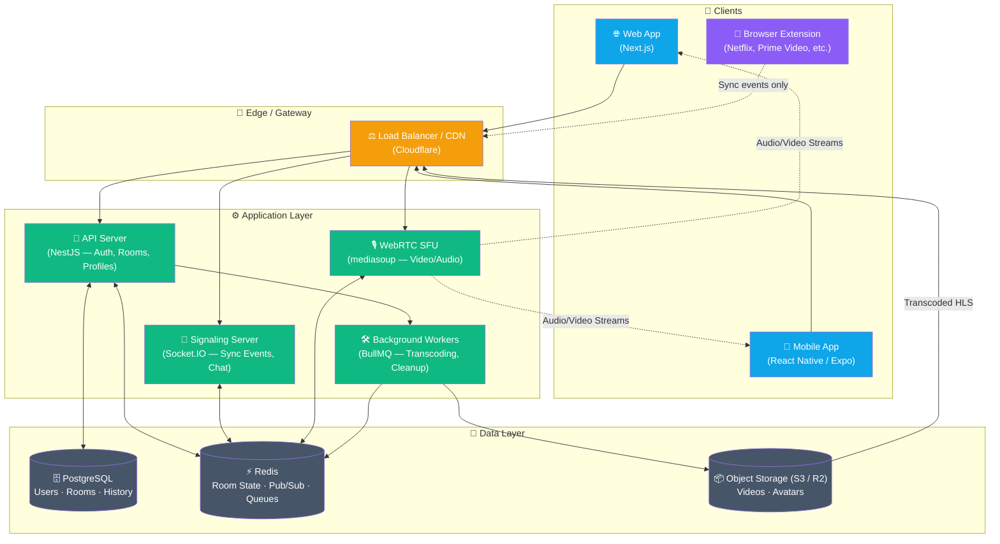
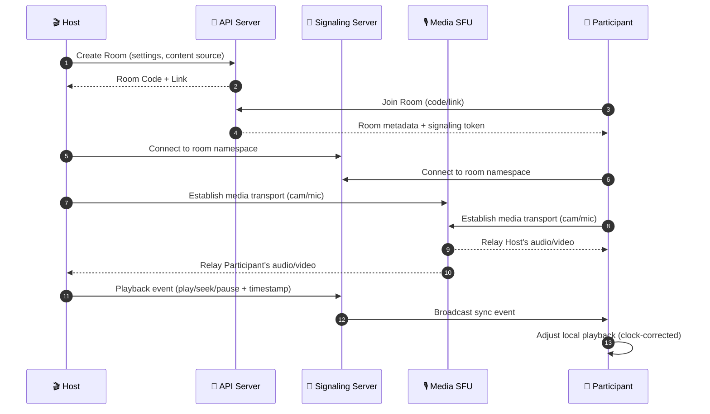

<div align="center">

# 🎬 Live-Connect

### Real-time synchronized watch parties — with built-in video chat

Watch YouTube, uploaded videos, screen shares, and your favorite streaming services together with friends, perfectly in sync, with live video & audio chat.

[](#license)
[](#)
[](#)
[](#)
[](#)
[](#)

</div>

---

## ✨ Overview

**Live-Connect** is an open-source, WebRTC-based watch-party platform. A host creates a **Room**, shares a link or code, and friends join from web or mobile for a perfectly synced viewing experience — complete with live webcam, voice chat, text chat, and emoji reactions.

Built to outperform existing watch-party tools (Watch2Gether, Teleparty, Hyperbeam, TwoSeven) on **sync accuracy**, **content flexibility**, and **social experience**.

### Why Live-Connect?

| | |
|---|---|
| ⚡ **Sub-second sync** | NTP-style clock correction keeps everyone within ~500ms |
| 🎥 **Built-in video/audio chat** | SFU-powered WebRTC (mediasoup) — scales beyond simple peer-mesh |
| 📺 **Multiple content sources** | YouTube, direct uploads, screen share, and streaming services via browser extension |
| 📱 **Web + Mobile** | Responsive web app and native iOS/Android apps from one codebase |
| 🧩 **Browser extension** | Sync Netflix, Prime Video & more — each viewer streams from their own account |
| 🔓 **Open source** | Self-host it, fork it, extend it |

---

## 🖼️ System Architecture



### How a watch session works



---

## 🧱 Tech Stack

<div align="center">

| Layer | Technology |
|:---|:---|
| **Web Frontend** | Next.js · TypeScript · Tailwind CSS · shadcn/ui · Zustand |
| **Mobile App** | React Native · Expo · TypeScript |
| **Backend API** | NestJS · Prisma · PostgreSQL |
| **Real-Time Signaling** | Socket.IO |
| **WebRTC Media** | mediasoup (SFU) |
| **Cache / Pub-Sub** | Redis |
| **Storage / CDN** | AWS S3 (or Cloudflare R2) · Cloudflare CDN |
| **Transcoding** | FFmpeg (via BullMQ workers) |
| **Browser Extension** | Plasmo (Chrome / Edge / Firefox) |
| **Monorepo** | Turborepo |
| **CI/CD** | GitHub Actions |
| **Monitoring** | Sentry · Grafana / Prometheus |

</div>

---

## 📂 Project Structure

```
live-connect/
├── apps/
│   ├── web/          # Next.js web application
│   ├── mobile/        # React Native (Expo) mobile app
│   ├── api/          # NestJS REST API (auth, rooms, profiles)
│   ├── signaling/      # Socket.IO + mediasoup SFU server
│   └── extension/      # Plasmo browser extension (streaming sync)
├── packages/
│   ├── types/         # Shared TypeScript types
│   ├── sync-protocol/  # Shared sync event schemas
│   └── config/        # Shared ESLint / TSConfig
└── turbo.json
```

---

## 🚀 Core Features

- 🔄 **Real-time playback sync** for YouTube, uploaded video (HLS), and screen shares
- 🎥 **Live video & audio chat** with grid / theater layout modes
- 💬 **Text chat** with emojis and floating **reaction overlays**
- 🧩 **Browser extension** for syncing Netflix, Prime Video, Disney+, and more
- 📋 **Playlists/queues** — line up multiple videos for a session
- 🔐 **Full account system** — email/password + OAuth, profiles, friends, room history
- 🛡️ **Room controls** — private/public rooms, passwords, host transfer, kick/ban
- 📱 **Native mobile apps** for iOS and Android

---

## 🏁 Getting Started

```bash
# Clone the repository
git clone https://github.com/<your-username>/live-connect.git
cd live-connect

# Install dependencies
npm install

# Set up environment variables
cp .env.example .env

# Start dev environment (Docker for Postgres + Redis)
docker compose up -d

# Run all apps in dev mode
npm run dev
```

> 📖 See [`docs/`](./docs) for detailed setup of the API, signaling server, mobile app, and browser extension.

---

## 🗺️ Roadmap

- [x] Project planning & architecture
- [ ] Auth & room management
- [ ] Sync engine (YouTube/embeddable)
- [ ] WebRTC video/audio chat
- [ ] Direct video upload & transcoding
- [ ] Browser extension (Netflix, Prime Video)
- [ ] Mobile apps (iOS/Android)
- [ ] Public beta launch

---

## 🤝 Contributing

Contributions are welcome! Please open an issue to discuss major changes before submitting a pull request.

1. Fork the repo
2. Create your feature branch (`git checkout -b feature/amazing-feature`)
3. Commit your changes
4. Push to the branch and open a PR

---

## 📄 License

This project is licensed under the [MIT License](LICENSE).

---

<div align="center">

Made with ❤️ for movie nights, watch parties, and long-distance friendships.

</div>
